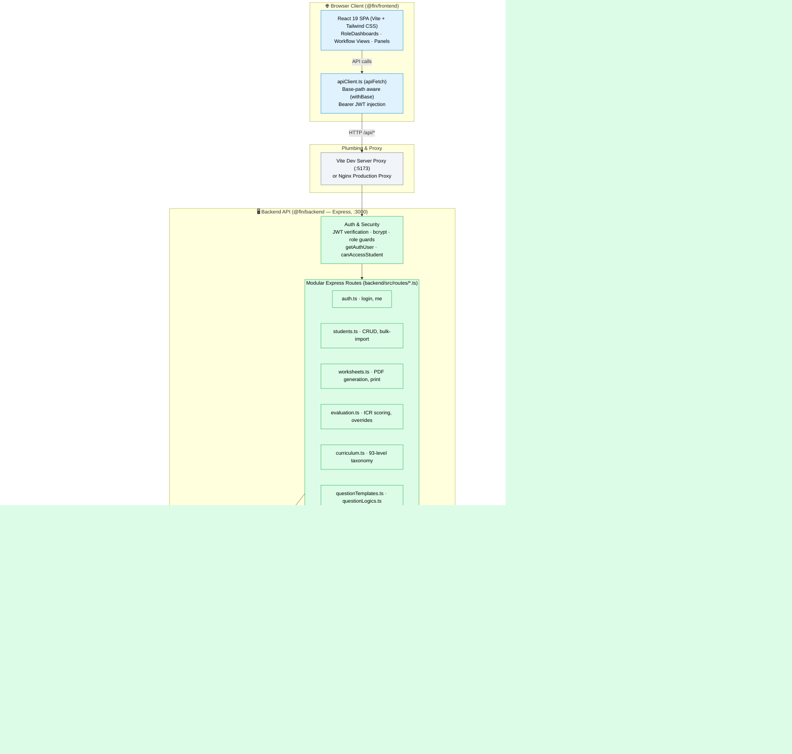
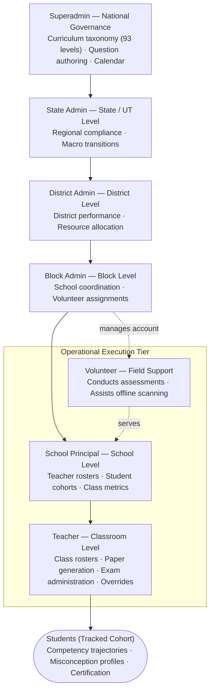
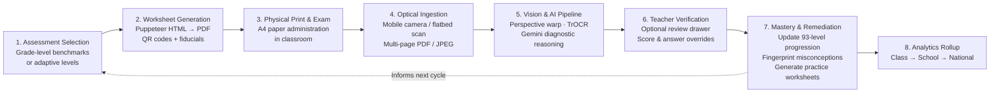

# Architecture

High-level architecture of the FLN (Foundational Literacy and Numeracy) platform. See [AUDIT.md](AUDIT.md) for historical audit context and [docs/adr/001-backend-structure.md](docs/adr/001-backend-structure.md) for backend architectural guidelines.

> ℹ️ **Architecture Overview:** The FLN platform is an **npm-workspaces monorepo** comprising a React 19 frontend (`frontend/`), a modular Express.js backend (`backend/`), and a Python optical & AI evaluation service (`ai-services/`). The legacy in-browser mock backend and `localStorage` interceptors have been completely retired; all client requests communicate with the real backend via `apiFetch()` with real JWT authentication and dual-persistence support (native MongoDB driver or zero-config local JSON file DB).

---

## 1. System Architecture



### Key Architectural Invariants
1. **Single Source of Truth**: The client-side mock backend and browser interceptors are deleted. All state transitions, scoring, and role permissions originate on the server.
2. **Base-Path Aware Routing**: All client network requests pass through `apiFetch()` (`frontend/src/services/apiClient.ts`), which uses the application's local `withBase()` helper (wrapping Vite's configured `import.meta.env.BASE_URL`) so the application deploys seamlessly at root domain or behind reverse-proxy subpaths (e.g., `/fln`).
3. **Modular Domain Routes**: Per [ADR 001](docs/adr/001-backend-structure.md), routes live in `backend/src/routes/<domain>.ts` exporting `register<Domain>Routes(app)` functions registered centrally in `backend/src/index.ts`.
4. **Flexible Dual Persistence**: Database operations go through `dbStore` in `backend/src/db.ts`. If `MONGODB_URI` is provided, it connects to MongoDB via the official `mongodb` native driver; otherwise, it operates against `data/db.json` (at repo root) without requiring external database dependencies.
5. **Server-Authoritative Authentication**: JSON Web Tokens (JWT) are cryptographically signed using a server-side secret (`JWT_SECRET`). Role-based access control (`getAuthUser`, `canAccessStudent`, `requireSuperadmin`) is strictly validated on each request.
6. **Isolated AI & Optical Services**: Heavy computer vision (OpenCV) and machine learning (TrOCR) pipelines run out-of-process in Python (`ai-services/`), preserving the responsiveness of the Node.js API event loop.

---

## 2. Role Hierarchy & Domain Governance

The FLN platform models a hierarchical educational administration workflow with distinct access boundaries:



---

## 3. Assessment & Evaluation Lifecycle

Every assessment cycle (Baseline, Periodic Diagnostics, Remediation) follows a closed-loop data progression:



### End-to-End Steps
1. **Paper Synthesis**: The backend compiles student metadata into QR identifiers, computes 4-corner fiducial alignment coordinates, and invokes Puppeteer to render print-ready PDFs.
2. **Administration & Scanning**: Physical assessment sheets are completed by students and scanned as PDFs or images.
3. **Automated Evaluation**: `ai-services/` detects fiducials, rectifies perspective skew, extracts response bounding boxes (ROIs), and executes OCR. Objective questions are scored against deterministic answer keys; complex handwritten responses are assessed via Gemini.
4. **Teacher Verification & Override**: Borderline or low-confidence readings can be adjusted by teachers via `PATCH /api/evaluation/:reportId/override`, triggering updates to level recommendations.
5. **Mastery Progression**: Results update student capability across the 93 foundational numeracy levels, identifying misconception fingerprints and compiling targeted remediation practice sheets.

---

## 4. Repository Directory Layout

```
fln/
├── frontend/                  # React 19 Single-Page Application
│   ├── src/
│   │   ├── components/        # Role dashboards, shared UI, and modal dialogs
│   │   │   ├── dashboards/    # Dedicated dashboards (Teacher, Volunteer, School, Admin, Superadmin)
│   │   │   └── panels/        # Functional subpanels (Students, Curriculum, Question Review, etc.)
│   │   ├── services/          # apiClient.ts (apiFetch, withBase), simulatedAnswers.ts
│   │   ├── data/              # Canonical skillProgressionMap.ts (93 levels)
│   │   └── types.ts           # Shared TypeScript interfaces
│   └── public/
│       ├── assets/            # Question SVG themes and manifest
│       └── worksheets/        # Standalone HTML templates for Puppeteer PDF rendering
├── backend/                   # Express.js REST API
│   ├── src/
│   │   ├── routes/            # Modular route controllers per domain (ADR 001)
│   │   │   ├── auth.ts        # Signed JWT login, password policy, user profile
│   │   │   ├── students.ts    # Student profiles, class scoping, bulk import
│   │   │   ├── worksheets.ts  # Worksheet compilation, paper generation, ZIP packaging
│   │   │   ├── evaluation.ts  # ICR scanning routes, score overrides, diagnostic reports
│   │   │   ├── curriculum.ts  # 93-level curriculum queries, coverage metrics
│   │   │   └── ...            # questionTemplates, tickets, admin, stats, misconceptions
│   │   ├── db.ts              # dbStore data access layer (native MongoDB + local db.json fallback)
│   │   ├── paperGenerator.ts  # Puppeteer PDF compiler with fiducial coordinates
│   │   └── gemini.ts          # Gemini API integration and answer matching
├── data/                      # Local JSON persistence & question bank (repo root)
│   ├── db.json                # Local file-based database store (zero-config fallback)
│   └── questionBank.json      # Canonical questions repository
├── ai-services/               # Python Evaluation & OCR Pipeline
│   ├── scripts/               # pdf_rasterize.py, ICR extraction, and scoring scripts
│   └── personalized_evaluation/ # Class-level exam templates and response models
├── docs/                      # Technical documentation, ADRs, and task specifications
│   ├── adr/                   # Architecture Decision Records (e.g. 001-backend-structure.md)
│   └── intern-dashboard-tasks.md # Scoped intern tasks
└── Research/                  # Pedagogical frameworks and 59→93 level crosswalk data
```
