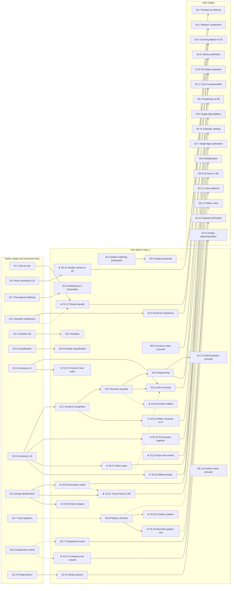

# FLN graph: the year before Class 1

**Decision record, 17 Sep 2026.** Curriculum decisions by Pavani, with research and drafting by Claude. Summarised to Jinal and Lakshya in the 17 Sep meeting.
**Graph checked at:** `origin/main` `af3f6710`.
**Relates to:** #388 (pilot slice), #482 (source sub-skills from NCERT/NIPUN/NCF), #469 (single `currentLevel` vs per-chain), and Jinal's 17 Sep email on the concept graph.

**What this PR changes:** research documents only. The prerequisite code is not edited. See [§9](#9-what-the-dev-team-does-next).

---

## 1. Why one stage at a time

Reviewing all 93 levels at once has been hard to follow, and the platform still has no working prototype. So we take **one stage through the whole loop** before touching the next:

1. Finalise the stage's nodes and prerequisites.
2. Generate its sheets.
3. Scan and capture responses.
4. Evaluate.
5. Carry the learnings into the next stage.

All other levels stay in the graph, untouched, until their turn.

**Sprint plan (17 Sep meeting):**
- the year before Class 1 end-to-end in about two days
- then Class 1, Class 2 and Class 3, about two days each

**The MVP ends at Class 3**, the FLN target. Class 4 and 5 content moves to a separate platform and is out of scope here.

## 2. Scope: the year before Class 1

- **Defined as "the year before Class 1", whatever the child's age.** The NCF-FS and NIPUN Bharat both say their age bands are indicative. A child may enter Class 1 at 5 or at 6.
  - The NCF-FS describes Balvatika as a one-year programme before Grade 1.
  - Some states (e.g. Maharashtra) call all three pre-school years Balvatika 1, 2 and 3.
  - So this document says "the year before Class 1", not "Balvatika".
- **Purpose:** before a child enters Class 1, do they have what Class 1 needs?
- **Not split into sub-stages.** Graph Stages 1–2 (L1–L17, pre-school years before this one) stay in the graph as they are. They are not assessed for now.

## 3. Which standard, and why

These are not competing standards. They are layers of one national system:

| Layer | Role |
|---|---|
| NEP 2020 | Policy: foundational literacy and numeracy for every child by Class 3 |
| NIPUN Bharat (2021) | Year-wise **targets**, Balvatika to Class 3; used for state-level measurement |
| NCF for the Foundational Stage (NCF-FS, 2022) | The **curriculum** for ages 3–8: learning outcomes, teaching, assessment |
| NCERT *Anand* Activity Book for Balvatika, Jaadui Pitara | Classroom **materials** |
| Aadharshila (Ministry of Women & Child Development, 2024) | Anganwadi curriculum for ages 3–6, **based on NCF-FS and NEP 2020** |
| State curricula | Built from the same set. Maharashtra's 2024 foundational-stage curriculum cites NCF-FS, the *Anand* books and Aadharshila (Pratham, *Situational Analysis Report on State Curricula*). |

**Decisions:**
- **Content = NCF-FS learning outcomes for this year.** It is the curriculum the other layers are built on.
- **Our earlier levels were built mainly from NIPUN Bharat.** NIPUN Bharat is the pass mark; the NCF-FS is the whole curriculum, and it goes further.
- **NIPUN Bharat's Balvatika targets = the readiness gate.** The report says:
  - "ready for Class 1" when the child is **Proficient** on the NIPUN concepts
  - "to strengthen" for any NCF-FS outcome not yet at Proficient

  Missing an NCF-FS outcome does not hold a child back.
- **Task formats = NCERT *Anand***, because it is what children use in class.
- **The graph includes every curriculum outcome**, including ones that can only be observed. A node is not dropped because a sheet or observation mechanism doesn't exist yet.

## 4. Assessment rules for this stage

- **No tests.** NCF-FS §6.1.2(a): *"Explicit tests and examinations are completely inappropriate assessment tools for this Stage."*
  - There is **no question paper** at this stage, only **worksheets**.
  - Results use the Holistic Progress Card's three attainment levels (**Beginner / Progressive / Proficient**, §4b), never pass/fail or marks.
- **Two kinds of sheet**, matching the NCF-FS's two assessment methods (§6.2): analysing what the child produces, and observing the child.
  - **Student worksheet:** the child does the activity on paper.
  - **Teacher observation sheet:** the teacher watches each child and records, for every observed activity, one of **three levels: did it on their own / with some help / with a lot of help** (Proficient / Progressive / Beginner, §4b). This replaces the tick-or-cross wording in the first version of this document. There is no shortcut: an observable skill has to be observed.
  - **Both are printed, filled in and scanned** through the existing scanning pipeline (`ai-services/PIPELINE.md`). The only difference is who writes on the sheet.
- **Teacher observation sheet layout: offer both, and the teacher chooses.**
  - a **class grid** (students × observable outcomes), easier for large classes
  - a **multi-page sheet with half a page per child**
- Tag every observation record **"teacher-observed"**, so reports can tell it apart from the child's own answers.
- **Until observation data exists,** observation-only nodes show **"not yet assessed"**, never "Beginner". Otherwise every child's heat map shows false gaps.
- **Maths vocabulary** (NCF-FS C-8.12) is **a check on every teacher observation sheet**, not a node.
- **Worksheet layout (Amrita's feedback):** current papers are too crowded. For this stage especially, use:
  - much more open space between items, because young children write large
  - larger diagrams

## 4b. Evaluation: what "ready" means for one concept (decided 17 Sep)

First decision of this stage's evaluation matrix. The other questions (items per concept, repeated observation, how far back to trace a gap, overall Class 1 readiness, the report) are still open.

**Evidence considered** (link map accepted by Pavani):

| Source | What it says | Use here |
|---|---|---|
| Holistic Progress Card, Foundational Stage (CBSE teacher guide, adapted from PARAKH) | Three attainment levels defined by **independence**: Beginner (a lot of support), Progressive (some support), Proficient (on their own). Observe 1–2 competencies a week. | Adopted as the reporting levels |
| ASER 2022 assessment tasks | One-to-one; number recognition needs at least 4 of 5 correct, subtraction 2 of 2 | Reference point for the child-sheet rule |
| Mastery learning (Bloom; Guskey) | Mastery criterion usually 80–90% | Reference point |
| Knowledge Space Theory (Falmagne et al. 1990) | Careless errors and lucky guesses are expected, so one wrong answer is not a gap | Principle: never decide on one item |
| Knowledge tracing (Corbett & Anderson 1995) | Mastered when the model is 95% confident, estimated from a sequence of answers | Later, once data exists |
| Hosoya et al. (2021), *Frontiers in Psychology* | Early-childhood teachers' maths judgements correlate about 0.79 with a standardised test, but vary a lot between teachers | Teacher observation is valid evidence if teachers share a clear description of each level |

No source found gives a required number of observations before a skill counts as secure.

**Decisions:**
- **Teacher observation sheet: three levels**, Proficient / Progressive / Beginner, as "on their own / with some help / with a lot of help" (§4).
- **Student worksheet: a provisional rule, deliberately loose at the start, tightened by data.** Working rule to begin with: **about 3 of 5 items correct on a concept = Proficient**. Label it *provisional* in every report.
  - This is lenient (60%) compared with ASER (4 of 5) and mastery learning (80–90%). That is intentional for a first version.
  - How items per concept fit on a sheet a 5-year-old can manage is still open.
- **Learning from data, under three conditions:**
  1. **Store every item response**, not only the resulting level, so any new rule can be re-run on past data.
  2. **Learn against a reference, not in a vacuum:** the teacher's three-level rating of the same child, and later, how the child copes in Class 1.
  3. **Data proposes, the team approves.** Each rule change gets a version number and is signed off. Same responses + same rule version always give the same result (#372's exit gate). The NCF-FS warns against labelling young children on weak evidence.
- **Expect slow tightening.** A pilot has few children per concept. Rules firm up at a few hundred children, not a few dozen.

## 4c. The rest of the evaluation matrix (decided 17 Sep)

### Items on the student worksheet

- **The diagnostic is one shot:** one sitting for the child, and one submitted teacher sheet. Practice worksheets are separate and can be longer.
- **Solid arrows cover earlier concepts on success.** A child who writes numerals correctly has shown numeral recognition. Only **→** edges count, never **⇢**. In this stage that covers only 5 of 31 nodes (S1.6, S3.1, S3.2, S3.6, S3.8), because most of this stage's arrows point out to Class 1–3.
- **Combined questions:** at most two concepts each, pictorial, with generous space.
- **Every concept assessed on the sheet also gets one question on its own**, unless a prerequisite chain already tells it apart. Without that, a wrong combined answer can't show which concept failed ("complete" Q-matrix: Chiu, Douglas & Li, 2009, *Psychometrika*). Heller (2022, *British Journal of Mathematical and Statistical Psychology*) and a 2018 *Frontiers in Psychology* paper ("Theorems and Methods of a Complete Q Matrix With Attribute Hierarchies Under Restricted Q-Matrix Design") show that prerequisite hierarchies relax this requirement; *only their abstracts have been read, so verify before relying on the relaxation.*
- **About three pieces of evidence per concept** (2 of 3 correct = Proficient, provisional, §4b). This gives **roughly 15 single-concept + 10 combined ≈ 25 questions**, instead of about 45 with three separate items per concept.

### Teacher observation

- The teacher plans observation however suits the class (across days, in small groups).
- The platform receives **one sheet with one three-level rating per concept per child, in one go**.
- **The heat map is produced only when both the student sheets and the teacher sheet are in.** Until then, observed concepts show "not yet assessed".

### When a child is Beginner on a concept: how far back

- **No fixed demotion, and no midpoint.** Picking the midpoint of the earlier levels is the "half-split rule" of Falmagne et al. (1990). It is for choosing the *next* question in a live adaptive test, which is worth keeping for a future digital version. A printed one-shot sheet has already been answered, so the actual answers are used instead.
- **Rule:** follow **solid arrows** back **as far as the sheet has evidence**. The **starting point** is the first weak concept whose own prerequisites are fine.
  - *Example:* Beginner on ordinal position (S4.13), Beginner on sequencing (S3.6), Proficient on numeral–quantity (S3.2) → "start with sequencing".
- If the trail reaches an earlier-stage concept that isn't assessed, report **"possible cause, not checked: <concept>"**.
- **"Ready to learn next"** is the Knowledge Space Theory **outer fringe**: concepts not yet shown whose prerequisites are all shown (Matayoshi et al., 2021, on ALEKS).

### Ready for Class 1 (the 7 NIPUN concept rows, 6 targets)

| Band | Rule |
|---|---|
| **Ready for Class 1** | Proficient on all 7 |
| **Almost ready** | No Beginner, at least one Progressive |
| **Needs support before Class 1** | Beginner on at least one |
| **Incomplete** | Any of the 7 not yet assessed. Flagged to the teacher; no band shown. |

- Other NCF-FS concepts **never change the band**; they only appear as areas to improve.
- Bands are **provisional** and are tightened by the same data loop as §4b: do "almost ready" children cope in Class 1?

### Who sees what

| Audience | Sees |
|---|---|
| **Teacher, per child** | One plain-language statement, no codes: band · % on track (share of this year's concepts at Proficient) · up to 3 areas to improve (the starting points above, NIPUN concepts first) · a flag for anything not yet assessed. *E.g. "Almost ready for Class 1 · 70% on track · Work on: sequencing, sharing equally, writing numbers."* |
| **Teacher, whole class** | Number of children in each band; the most common areas to improve, for planning group activities (NCF-FS §6.1.1(f) asks for an aggregate class view) |
| **Parent** | Areas to improve, each with one home activity. **No band:** NCF-FS §6.1.1(h) warns against labelling children "especially based on poorly designed assessments", and these bands are still provisional. |
| **Student or teacher login, optional** | A **"show concept map" toggle** that reveals the heat map, always labelled **tentative and not yet accurate** |
| **Backend (team and research)** | Full heat map: every concept's level and whether it was tested, observed or inferred · every raw response · the rule version |

### Accuracy: what makes the map trustworthy, and its known limits

The priority is generating the map as accurately as possible; visibility is secondary.

**What the design already does for accuracy:**
- a single-concept question for each assessed concept, so failures can be traced to a concept
- inference only across solid (→) arrows
- three pieces of evidence per concept rather than one
- teacher ratings on a shared three-level description
- every raw response stored, and every rule versioned, so results can be recomputed

**Known limits, each with its fix:**
1. **Thresholds are guesses** (2 of 3, the bands). *Fix:* calibrate against teacher ratings and later Class 1 outcomes (§4b).
2. **Teachers rate differently from one another.** Hosoya et al. (2021) found teachers accurate on average but varying widely. *Fix:* each three-level rating needs a concrete description of what "on their own / some help / a lot of help" looks like for each concept.
3. **The prerequisite edges are expert judgement, not yet tested on children.** *Fix:* once responses exist, check each → edge. Children who pass the later concept but fail the earlier one are evidence against that edge.
4. **A one-shot sheet can't resolve every failure.** Some starting points will stay "possible cause, not checked". *Fix:* a future adaptive digital version (half-split rule).
5. **Small pilot numbers.** Rules firm up at a few hundred children.

## 5. The 30 NCF-FS outcomes and where each goes

**Source:** NCF-FS 2022, Annexure 1, Tables 29–41 (C-8.1 to C-8.13). Column C = age 5–6. Wording shortened.
**NIPUN ★:** one of NIPUN Bharat's six Balvatika numeracy targets (`FLN_foundation.md` §4).
**Sheet:** Student / Teacher / Both.
**Move vs split:** a curriculum judgement, approved 17 Sep.

### 5a. Already in the graph at this stage: keep

8 outcomes, on 6 nodes.

| # | Outcome | NIPUN | Node | Sheet | NCERT *Anand* task |
|---|---|---|---|---|---|
| 2 | Counts objects to 10; the last number said is the total | ★ | S3.2 (L19) | Both | Count and Write (Act. 66) |
| 7 | Recognises numerals to 9 | ★ | S3.1 (L18) | Student | Numbers (Act. 67) |
| 9 | Compares two numbers to 9 ("more than / less than") | ★ | S3.3 (L20) | Student | none found, to design |
| 14 | Sorts objects by features they recognise | ★ | S3.5 (L22) | Both | Colour the Shapes (Act. 19) |
| 15 | Arranges up to 5 objects by size, length or weight | ★ | S3.4 (L21), partly | Both | like Just the Right Size (Act. 39) |
| 19 | Classifies objects by three features | | S3.5 (L22), partly | Teacher | |
| 24 | Compares three objects by length or height | ★ | S3.7 (L24) | Student | Just the Right Size (Act. 39) |
| 25 | Compares three objects by weight | ★ | S3.7 (L24) | Both | |

### 5b. In an earlier-stage node: extend its definition (2)

| # | Outcome | Node | Change | Sheet |
|---|---|---|---|---|
| 6 | Sees 6 objects at a glance | S2.9 (L16) | ~4–6 → 6 | Teacher |
| 18 | Matches shapes of different sizes and orientations | S1.6 (L6) | identical shapes → any size or orientation | Student: Match the Shapes (Act. 15), Find and Match the Figure (Act. 57) |

### 5c. In a later-stage node: move to this stage (4)

Only the stage label changes; the S-code stays the same. Prerequisite links are unchanged unless noted.

| # | Outcome | Node | Sheet | Note |
|---|---|---|---|---|
| 4 | Zero as "none left" after taking away | S4.12 (L39, Class 1) | Student: Zero (Act. 68–69) | |
| 5 | 1st, 2nd, 3rd position | S4.13 (L40, Class 1) | Student | |
| 20 | Position words (inside, under, beside) | S5.13 (L55, Class 2) | Both | **Remove the incoming ⇢ edge from S5.12 (Class 2).** After the move it would point backwards. |
| 28 | Identifies Indian currency notes | S5.9 (L51, Class 2) | Student | |

### 5d. In a later-stage node: split off a new early node (11)

The later node keeps its content and existing links, and gains the new node as a prerequisite (see 5g).

| # | New node (proposed S-code) | Split from | Stays in the later node | Sheet |
|---|---|---|---|---|
| 1 | S3.11 Says number names to 20 | S4.3 (L30) Counting Objects to 20 | counting objects to 20 | Teacher |
| 8 | S3.13 Writes numerals to 9 | S4.4 (L31) Reading & Writing to 99 | to 99 | Student: Count and Write (Act. 66) |
| 10 | S3.14 Puts two groups together (total ≤ 9) and recounts, no + symbol | S4.6 (L33) Single-Digit Addition | with the + symbol | Both: Adding up the Vegetables (Act. 74) |
| 11 | S3.15 Takes away (≤ 9) and recounts, no − symbol | S4.7 (L34) Single-Digit Subtraction | with the − symbol | Both: 1 Less Plane (Act. 75) |
| 12 | S3.16 Makes small groups; counts objects and groups | S5.6 (L48) Multiplication as Repeated Addition | multiplication | Teacher |
| 13 | S3.17 Shares up to 20 objects equally among 4–5 | S5.7 (L49) Division as Equal Sharing | division problems | Both |
| 17 | S3.19 Describes the rule of a repeating pattern | S6.13 (L74) Pattern Rules | number-pattern rules | Teacher |
| 21 | S3.20 Describes solids in own words ("a ball rolls") | S4.8 (L35) 3D Shape Properties | faces, edges, corners | Teacher |
| 22 | S3.21 Traces the faces of 3D objects | S6.9 (L70) Relating 2D Faces to 3D | relating 2D to 3D | Teacher |
| 26 | S3.23 Compares how much two vessels hold | S4.10 (L37) Capacity Estimation | estimating with units | Teacher |
| 27 | S3.24 Names days of the week and months of the year | S5.14 (L56) Calendar Reading | reading a calendar | Teacher |

### 5e. Not in the graph: new nodes (4)

| # | New node (proposed S-code) | Sheet | Note |
|---|---|---|---|
| 3 | S3.12 Counts in any order; the total stays the same | Teacher | Only the final number shows on paper, not the counting order |
| 16 | S3.18 Creates a new pattern (colour, shape, size) | Both | Teacher checks that it repeats |
| 23 | S3.22 Draws circle, square, triangle freehand | Student | Teacher judges accuracy |
| 30 | S3.25 Solves simple number riddles and puzzles | Teacher | |

Row 29 (maths vocabulary) is a check on the teacher observation sheets, not a node (§4).

### 5f. Totals

| | Count |
|---|---|
| NCF-FS outcomes for this year | 30 (29 as nodes, plus vocabulary as a check) |
| Existing nodes kept for these outcomes | 6 |
| Earlier-stage nodes extended | 2 |
| Later-stage nodes moved to this stage | 4 |
| New nodes (11 split + 4 new) | 15 |
| Existing Stage-3 nodes with no NCF-FS column-C outcome (§7) | 4 |
| **Nodes in this stage's graph** | **31** |
| Sheets for the 29 outcome nodes: Student / Both / Teacher | 9 / 9 / 11 |

**All six NIPUN Bharat targets were already covered by Stage-3 nodes.** The gap was the rest of the curriculum.

### 5g. Prerequisites for the new nodes

Edge types follow Part 2 of `fln_level_networks.md`, using the surmise test *"does passing the downstream node make upstream mastery near-certain?"*
- **→** prereq
- **⇢** sequence only; no inference drawn

**Evidence key:**
- **NCF:** the NCF-FS learning-outcome trajectory. Each outcome builds on the earlier column's outcome in the same table (Annexure 1: "a trajectory… rather than exact age-specific goals").
- **G&G:** Gelman, R. & Gallistel, C. R. (1978). *The Child's Understanding of Number.* Harvard University Press. One of their five counting principles is **order irrelevance**: objects can be counted in any order without changing the result. It sits alongside one-one, stable order, cardinal and abstraction.
- **F&B:** Frydman, O. & Bryant, P. (1988). Sharing and the understanding of number equivalence by young children. *Cognitive Development*, 3(4), 323–339. **4-year-olds share by one-to-one "dealing" but usually don't connect sharing to equal numbers.**
- **VH:** Van Hiele levels, as already used in Chain D.
- **Reasoning:** no external source; stated in the note.

| Source | Target | Type | Evidence and note |
|---|---|---|---|
| S1.4 Rote counting to 10 | **S3.11** Number names to 20 | → | NCF C-8.3 (to 10 → to 20). Reciting to 20 contains reciting to 10. |
| **S3.11** | S4.3 Counting objects to 20 | → | You can't count 20 objects without the number names to 20 |
| S2.4 Counting to 5, cardinality | **S3.12** Counts in any order | → | G&G (order irrelevance); NCF C-8.3 places it at C, after cardinality at B. The judgement "the total stays the same" needs cardinality. |
| S3.1 Numeral recognition | **S3.13** Writes numerals to 9 | → | NCF C-8.5 (recognises at B → writes at C). Writing a numeral correctly implies recognising it. |
| **S3.13** | S4.4 Read/write to 99 | → | Writing to 99 contains writing to 9 |
| S2.5 Counting 6–10 | **S3.14** Puts groups together, recounts | → | NCF C-8.6 (to 5 at B → to 9 at C). Recounting to 9 needs counting to 9. |
| **S3.14** | S4.6 Single-digit addition | → | NCF C-8.6 (objects at C → addition facts at D) |
| S2.5 Counting 6–10 | **S3.15** Takes away, recounts | → | NCF C-8.6, same logic |
| **S3.15** | S4.7 Single-digit subtraction | → | NCF C-8.6 |
| **S3.15** | S4.12 Zero | ⇢ | NCF C-8.3 introduces zero through taking away. But a child can know zero as "none" without taking away up to 9, so it is sequence only. |
| S2.5 Counting 6–10 | **S3.16** Makes groups, counts them | → | NCF C-8.7 row 1. Counting the objects needs counting. |
| **S3.16** | S5.6 Multiplication as repeated addition | → | NCF C-8.7 (makes groups at C → multiplication by grouping at D) |
| S1.1 One-to-one correspondence | **S3.17** Shares equally | → | F&B: sharing is done by one-to-one dealing |
| S2.1 Quantity comparison | **S3.17** | ⇢ | F&B found children share by dealing **without** connecting it to equal numbers, so passing sharing does not certify comparison. Sequence only. |
| **S3.17** | S5.7 Division as equal sharing | → | NCF C-8.7 row 2 (shares at C → sharing for division problems at D). **S5.7 has no prerequisite edge today.** |
| S3.8 Patterns (2-item, 3-item) | **S3.18** Creates a new pattern | → | NCF C-8.2 (extends at B → creates at C) |
| S3.8 | **S3.19** Describes a pattern's rule | → | NCF C-8.2 (extends at B → describes rule at C) |
| **S3.19** | S6.13 Pattern rules | ⇢ | Repeating-pattern rules don't gate number-pattern rules. This follows Part 2's own S4.11 ⇢ S5.16 note on different modality. |
| S2.6 Shape identification | **S3.20** Describes solids in own words | → | VH Level 0 → 1, same as the existing S2.6 → S4.8 |
| **S3.20** | S4.8 3D shape properties | → | Naming faces, edges and corners implies describing solids informally |
| S2.6 Shape identification | **S3.21** Traces faces of 3D objects | → | Naming the traced shape needs shape identification. NCF C-8.8. |
| **S3.20** | **S3.21** | ⇢ | Tracing is hands-on and doesn't require describing. Same stage, sequence only. |
| **S3.21** | S6.9 Relating 2D faces to 3D | → | NCF C-8.8 (tracing faces at C → relating 2D and 3D later). Relating implies being able to find the faces. |
| S2.6 Shape identification | **S3.22** Draws shapes freehand | → | Drawing "a triangle" requires knowing which shape is a triangle. NCF C-8.8. |
| S2.8 Comparative vocabulary | **S3.23** Compares two vessels | ⇢ | NCF C-8.9 volume row (vocabulary at B → compares at C). Typed ⇢ following the 2026-08-21 demotion of S2.8 → S3.7. |
| **S3.23** | S4.10 Capacity estimation | → | Estimating capacity implies being able to compare it |
| **S3.24** Names days and months | S5.14 Calendar reading | → | NCF C-8.10. You can't read a calendar without the names. **S5.14 has no prerequisite edge today.** S3.24 is an entry point with no prerequisite. |
| S3.2 Numeral–quantity | **S3.25** Number riddles and puzzles | ⇢ | NCF C-8.13 ("uses number knowledge"). Riddles are oral and don't strictly need numerals, so sequence only. |

**Two orphan nodes fixed:** S5.7 (Division as Equal Sharing) and S5.14 (Calendar Reading) had no prerequisite edges before this change.

**OR prerequisites (#466):** every edge above is a single-route (AND) link, because the graph supports only AND today.

## 6. The graph for this stage

- Solid arrow = prereq (→). Dotted = sequence (⇢).
- Left: earlier-stage nodes feeding in. Right: later-stage nodes this stage feeds.
- New nodes are marked ★; moved and extended nodes are labelled.
- Edges between two earlier-stage nodes, or two later-stage nodes, are omitted.

## 7. Stage-3 nodes with no NCF-FS column-C outcome (open)

These stay in the graph. Whether each stays as it is is still open.

- **S3.4 transitivity** (A>B, B>C ⇒ A>C). NCF-FS asks only for ordering up to 5 objects (row 15).
- **S3.6 Sequencing.** Matches NIPUN's "arranges by sequence". The app title is "Numeral Sequencing", but the definition includes events, and NCF-FS puts arranging events at age 3–4.
- **S3.8 extending patterns** and **S3.10 shape pictures.** NCF-FS puts these a column earlier. Its outcomes are cumulative, so they still apply.
- **S3.9 shape properties.** The closest NCF-FS outcome is describing solids (S3.20).

## 8. Still open

1. The §7 nodes.
2. How to score teacher-judged work (S3.18, S3.22).
3. Write a concrete description of the three teacher-rating levels for each observed concept (§4c, accuracy limit 2).
4. Check NIPUN's Balvatika targets against the original document, and whether they changed after NCF-FS (2022).
5. Which prerequisites are really OR (#466). Settle through teacher sessions, not on paper.

**Where Jinal's 17 Sep questions stand:**

| Question | Status |
|---|---|
| A / 3: OR prerequisites | Agreed in principle (#466). Which links are OR comes from teacher sessions. |
| B / 9: graph, not a ladder | Agreed. Spec §17 already says so. |
| C / 10–11: no single "Current Level"; mastery view | Agreed. Mastery per concept, not per strand, on three levels (§4b). Observation nodes show "not yet assessed" until data exists. |
| D / 12: what counts as mastered | **Decided (§4b–4c):** three levels, a provisional rule, about 3 pieces of evidence per concept, follow solid arrows back as far as the evidence goes, readiness bands on the NIPUN concepts. |
| 1–2: two-digit addition | Class 1–2, waits its turn. The graph has no "2-digit addition without regrouping" node. |
| 4: early symmetry | **Out of MVP scope** (S7.17 is Class 4). |
| 5: perimeter | **Out of MVP scope** (S7.18 is Class 4). |
| 6: six-digit place value | **Out of MVP scope** (Class 4 and above). |
| 7–8: copying a pattern / identifying its rule | Partly answered here: S3.18 (creates) and S3.19 (describes the rule) now sit in this stage. |

## 9. What the dev team does next

- **`backend/src/competencyPrerequisites.ts` is generated from Part 2 of `fln_level_networks.md`.** This PR adds the new edges in a separate **Part 2b** of that document. They can't go straight into the chain tables, because the new S-codes don't exist in `curriculumMap.ts` yet, and `validateConceptPrerequisites()` rejects unknown ids.
- To take this into code:
  1. Register the 15 new nodes.
  2. Update the stage labels of the 4 moved nodes and the definitions of the 2 extended ones.
  3. Move the Part 2b rows into their chain tables.
  4. Regenerate the TypeScript. Only → edges are reproduced there.
- **Level numbers will shift — decide how to handle it before registering nodes.** *(Corrects the first version of this document, which said new nodes could take numbers "at the end".)*
  - L-numbers are **computed** as the n-th S-code in stage order (`scripts/check-level-notation-drift.ts`). So adding 15 nodes to Stage 3 shifts every level from L28 onwards.
  - Newer records are already keyed by `conceptId`, with the level number as a display alias only (`backend/src/db.ts`, `QuestionTemplate`). #350 (a `concepts` collection with stable ids) is the natural place to make that the rule everywhere.
  - Legacy `questionBankId()` still builds the level number into stored ids (README §2), so either migrate those ids or freeze the old numbers. That is the dev team's call.
  - The proposed S-codes (S3.11–S3.25) follow the existing stage convention; final ids are also the dev team's call.
- **Worksheet generation** for this stage needs:
  - two sheet types (student, teacher observation)
  - both teacher layouts
  - roomier spacing and larger diagrams
  - the word "worksheet", not "question paper"

## Sources

- NCF for Foundational Stage 2022 (NCERT). §6.1.2, §6.2, Annexure 1 Tables 29–41. https://ncert.nic.in/pdf/NCF_for_Foundational_Stage_20_October_2022.pdf
- NCERT, *Anand*: Activity Book for Balvatika. https://ncert.nic.in/division/dek/pdf/JP_Content/56_Anand_Activity_Book_for_Balvatika-English.pdf
- NIPUN Bharat Mission & FLN Lakshyas. https://cdnbbsr.s3waas.gov.in/s3kv03f32614ba98288e85e9833e8a523e/uploads/2024/08/2024081816.pdf
- Pratham, *Situational Analysis Report on State Curricula*. https://www.pratham.org/wp-content/uploads/2026/04/7.-Situational-Analysis-Report-on-State-Curricula_Final.pdf
- Ministry of Women & Child Development, Early Childhood Care and Education (Aadharshila). https://www.wcd.gov.in/offerings/early-childhood-care-and-education
- Gelman, R. & Gallistel, C. R. (1978). *The Child's Understanding of Number.* Harvard University Press.
- Frydman, O. & Bryant, P. (1988). Sharing and the understanding of number equivalence by young children. *Cognitive Development*, 3(4), 323–339. https://www.sciencedirect.com/science/article/abs/pii/0885201488900196
- Holistic Progress Card for Foundational Stage, Teacher Guide (CBSE, adapted from PARAKH). https://cbseacademic.nic.in/web_material/Manuals/HPC_TeacherGuide.pdf
- ASER 2022 Assessment Tasks. https://img.asercentre.org/docs/ASER%202022%20report%20pdfs/All%20India%20documents/About%20the%20survey/ASER_2022_AssessmentTasks.pdf
- Guskey, T. R. In Search of a Useful Definition of Mastery. https://tguskey.com/wp-content/uploads/Mastery-Learning-2-In-Search-of-a-Useful-Definition-of-Mastery.pdf
- Corbett, A. T. & Anderson, J. R. (1995). Knowledge tracing: Modeling the acquisition of procedural knowledge. *User Modeling and User-Adapted Interaction*, 4(4), 253–278.
- Falmagne, J.-C., Koppen, M., Villano, M., Doignon, J.-P. & Johannesen, L. (1990). Introduction to knowledge spaces. *Psychological Review*, 97(2), 201–224. In repo: `Research/Falmagne_1990_KST_HCI.pdf`.
- Hosoya, G., Blömeke, S., Eilerts, K., Jenßen, L. & Eid, M. (2021). Absolute and relative judgment accuracy: early childhood teachers' competence to evaluate children's mathematical skills. *Frontiers in Psychology*. https://pmc.ncbi.nlm.nih.gov/articles/PMC8558252/
- Chiu, C.-Y., Douglas, J. A. & Li, X. (2009). Cluster analysis for cognitive diagnosis. *Psychometrika*.
- Heller, J. (2022). Complete Q-matrices in conjunctive models on general attribute structures. *British Journal of Mathematical and Statistical Psychology*. https://bpspsychub.onlinelibrary.wiley.com/doi/full/10.1111/bmsp.12266
- Theorems and Methods of a Complete Q Matrix With Attribute Hierarchies Under Restricted Q-Matrix Design (2018). *Frontiers in Psychology*. https://pmc.ncbi.nlm.nih.gov/articles/PMC6092632/
- Matayoshi, J. et al. (2021). A practical perspective on knowledge space theory: ALEKS and its data. *Journal of Mathematical Psychology*. https://jmatayoshi.github.io/publications/JMP2021_KST_ALEKS_preprint.pdf
